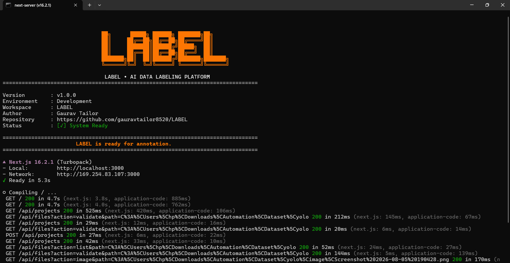

# <p align="center"><br>LABEL</p>

<p align="center">
  <a href="https://github.com/gauravtailor8520/LABEL/blob/main/LICENSE"></a>
  
  
  
  
</p>


<p align="center">
  
</p>

> [!IMPORTANT]
> **LABEL** is a high-performance, filesystem-first AI document labeling workspace designed for speed, precision, and complete data privacy. Easily annotate invoice forms, receipts, and dense layouts with real-time automatic saving and deep validation diagnostics.

---

## Video Demonstration

https://github.com/user-attachments/assets/36415595-91f7-4eb2-9cdc-391731120054
> [!NOTE]
> *Video walk-through of all sections.*

---

## Key Features

*   **Filesystem-First Architecture**: No external databases, servers, or cloud syncing required. Read and write directly to your local YOLO dataset folders with complete data privacy.
*   **Real-Time Auto-Save**: Seamlessly saves your annotation modifications to disk with a 1-second debounce (can be toggled in the header).
*   **Optimized for Invoices & Dense Forms**: Supports ultra-high-resolution images, fine-grained details, and complex documents.
*   **Smart Interactive Workspace**:
    *   **Smooth Zooming & Panning**: Use mouse wheel scroll to zoom and right-click-drag (or background-left-click-drag) to pan.
    *   **Precise Box Tuning**: Edge-anchored bounding box drawing and resizing.
    *   **Copy & Paste (Ctrl+C / Ctrl+V)**: Replicate identical label bounding boxes instantly across areas.
*   **Comprehensive Data Diagnostics Dashboard**:
    *   **Dataset Health Score**: Analyzes box overlaps, empty annotations, out-of-bounds coordinates, and label-to-image ratios.
    *   **Unified Validation Console**: Identifies duplicate images, duplicate labels, unlinked images/labels, and unregistered class categories.
    *   **Distribution Analysis**: Highlights class frequency imbalances and category configurations.
*   **Extension Support**: Built-in support for real-time WebSocket communication and streaming dataset sync.

---

## Installation & Getting Started

### Prerequisites
Make sure you have [Node.js](https://nodejs.org/) (v18.x or higher) and package manager of your choice (`npm`, `pnpm`, or `yarn`) installed.

### 1. Clone & Install Dependencies
```bash
git clone https://github.com/gauravtailor8520/LABEL.git
cd LABEL
npm install
# Or if using pnpm: pnpm install
```

### 2. Run the Development Server
```bash
npm run dev
# Or: pnpm dev
```
Open [http://localhost:3000](http://localhost:3000) in your browser to start labeling.

---

## How to Prepare Your Dataset

LABEL Studio is filesystem-first and assumes a clean directory layout. Set up your dataset directory using the following structure:

```text
my-dataset-workspace/
├── image/       (Contains your .png, .jpg, .jpeg images)
├── label/       (Contains matching YOLO .txt annotation files)
└── classes.json (Your category and class label definitions)
```

### Creating `classes.json`
Before loading the project, define your category configuration in `classes.json` at the root of your dataset folder:

```json
{
  "categories": [
    { "id": 0, "name": "header_logo" },
    { "id": 1, "name": "invoice_number" },
    { "id": 2, "name": "billing_address" },
    { "id": 3, "name": "line_item" },
    { "id": 4, "name": "total_amount" }
  ]
}
```

---

## Workspace Keyboard Shortcuts

| Shortcut | Description |
| :--- | :--- |
| **`Ctrl` + `S`** | Manually save active file modifications |
| **`Ctrl` + `C`** | Copy the currently selected bounding box annotation |
| **`Ctrl` + `V`** | Paste the copied bounding box onto the workspace |
| **`Backspace`** / **`Delete`** | Remove the selected bounding box |
| **`Mouse Wheel Scroll`** | Zoom in / Zoom out of the active document |
| **`Right Click` + `Drag`** | Pan the canvas around the document |
| **`Left Click` + `Drag`** | Draw a new bounding box (or pan canvas if clicking on empty background) |

---

## Dataset Diagnostics & Integrity Report

The platform features an advanced analytical suite to validate dataset quality:
1.  **Overview Report**: View class frequency splits, bounding box sizes, and dataset health score summaries.
2.  **Dataset Integrity Checks**: Instantly scan your directories for:
    *   **Duplicate Image Files**: Images with different filenames but identical binary content.
    *   **Duplicate Label Files**: Label files containing identical sets of bounding boxes.
    *   **Unlinked Images**: Images missing their corresponding `.txt` annotation file.
    *   **Unlinked Labels**: `.txt` annotation files missing the corresponding image file.
    *   **Unregistered Classes**: Bounding boxes tagged with class IDs not configured in your `classes.json`.
3.  **One-Click Purges**: Batch delete or resolve duplication and orphan file warnings directly from the dashboard validation table.

---

## Architecture

LABEL Studio is built using a modern, performant web stack:
-   **Framework**: [Next.js](https://nextjs.org/) (App Router, Tailwind CSS, TypeScript)
-   **State Management**: React Context & Hooks
-   **Iconography**: [Lucide React](https://lucide.dev/)
-   **Charts & Visualization**: [Recharts](https://recharts.org/)
-   **Transitions & Animations**: [Framer Motion](https://www.framer.com/motion/)

## Feedback & Contributions

We welcome community contributions, ideas, bug reports, and general feedback to make LABEL Studio even better!

### 💬 Feedback & Suggestions
If you have suggestions, feature requests, or find any bugs, feel free to:
*   Open an [Issue](https://github.com/gauravtailor8520/LABEL/issues) to report bugs or request features.
*   Contribute to discussions and ask questions.

### 🛠️ Contributing
We love collaboration! To contribute:
1.  Fork the repository.
2.  Create your feature branch (`git checkout -b feature/LABELFeature`).
3.  Commit your changes (`git commit -m 'Add some LABELFeature'`).
4.  Push to the branch (`git push origin feature/LABELFeature`).
5.  Open a Pull Request.

---

## License

Distributed under the MIT License. See [LICENSE](LICENSE) for more information.

---

<p align="center">
  <strong>Built with ❤️ for the community</strong><br>
  I love building open-source tools that are genuinely useful, free, and accessible for everyone. This project is created for the community to learn, grow, and build together!
</p>
